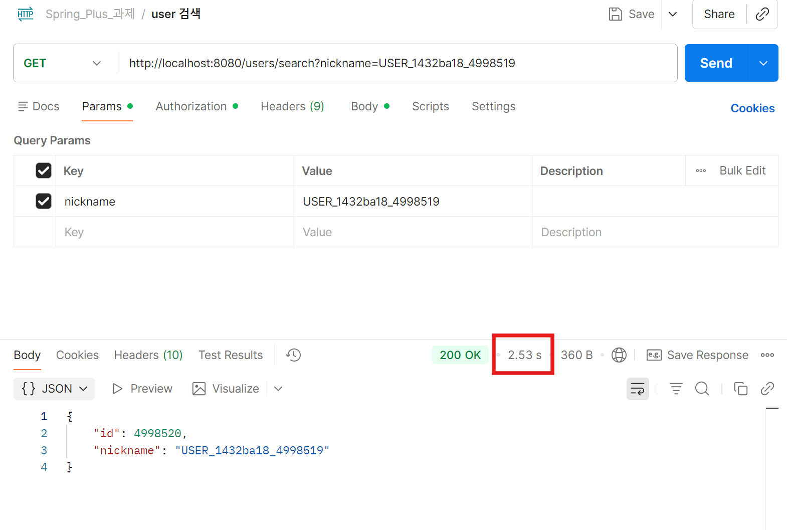
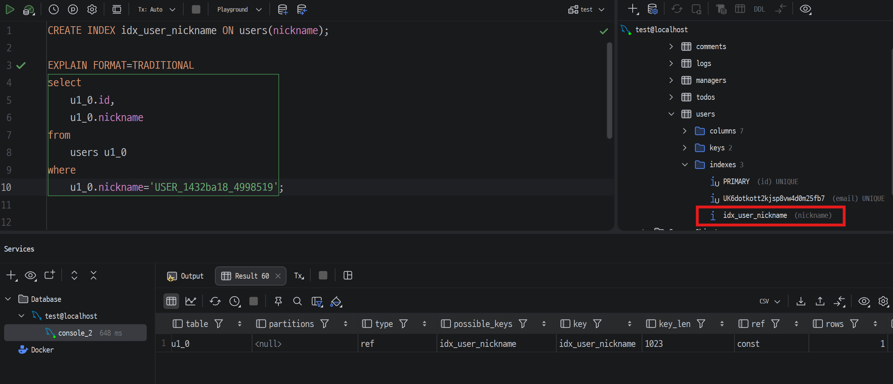
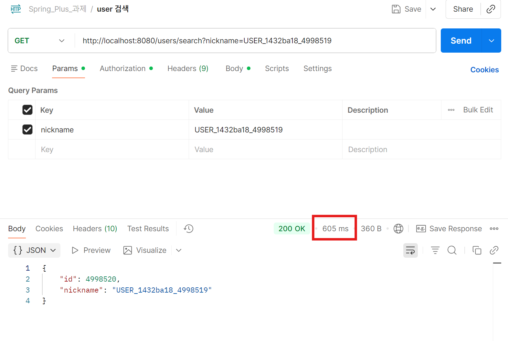
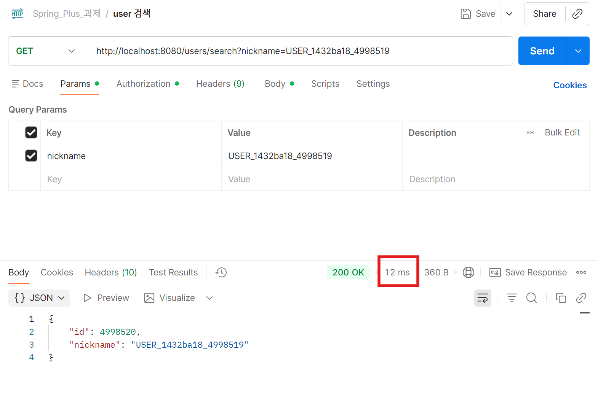

# Level 3
## 13. 대용량 데이터 처리

---

### [1-1] 최초 조회 속도

  

### [1-2] 최초 조회 쿼리 성능

  

---

### [2-1] 인덱스 적용 후 쿼리 성능

  

### [2-2] 인덱스 적용 후 조회 속도

  

---

### [3-1] Redis 적용 후

  

### [3-2] 인덱스 적용 후 조회 속도

  

---
