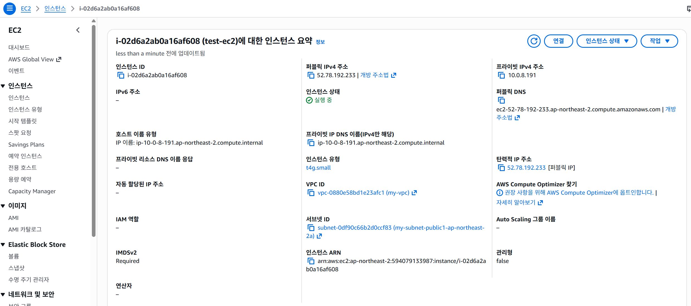
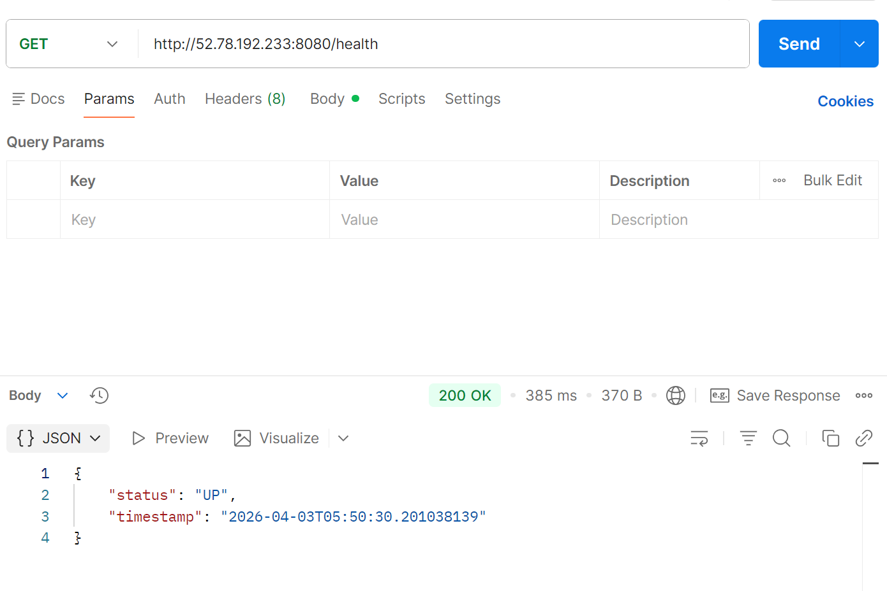
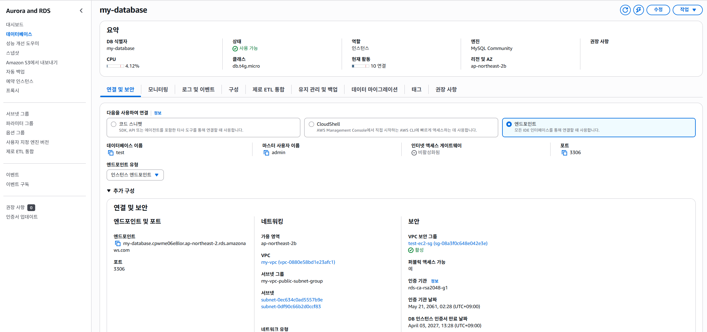
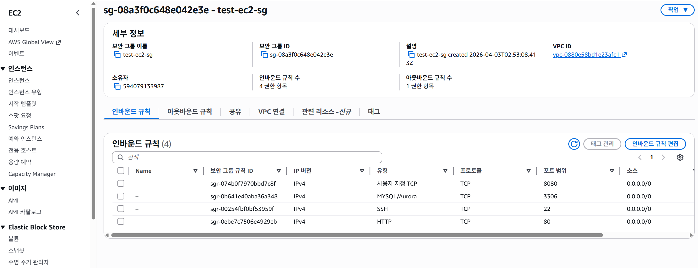
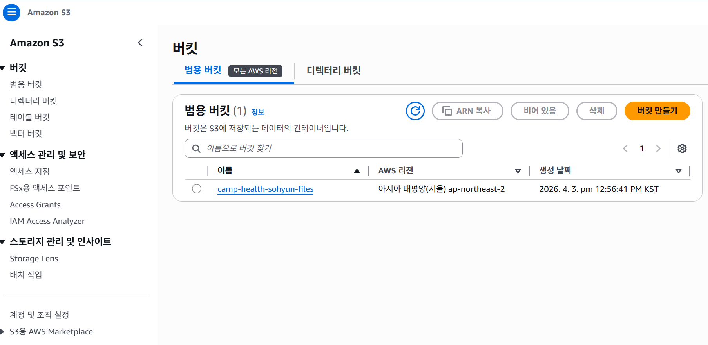
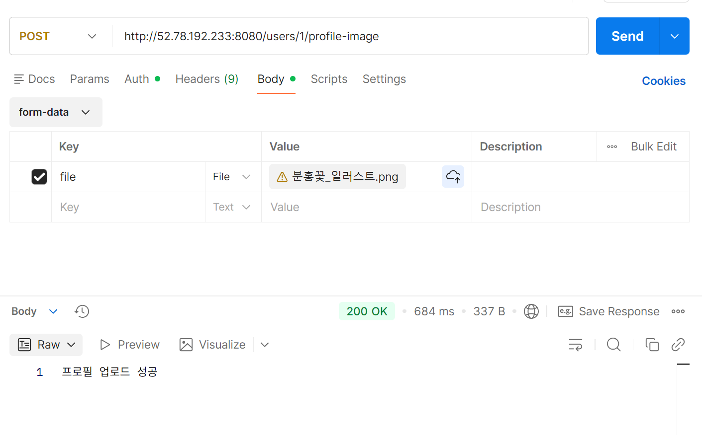
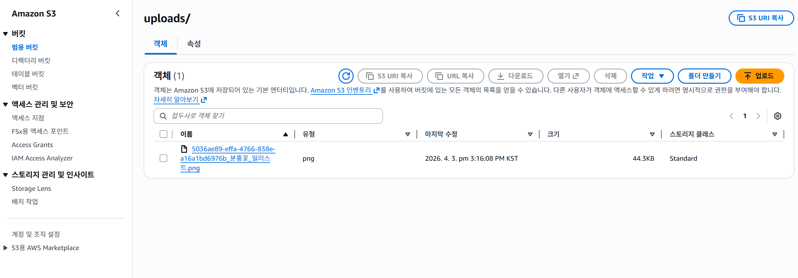
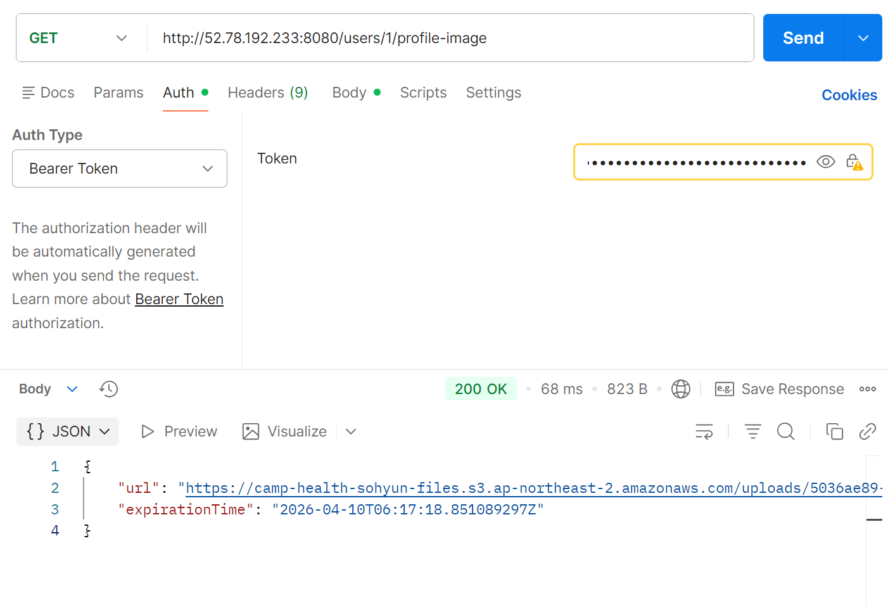
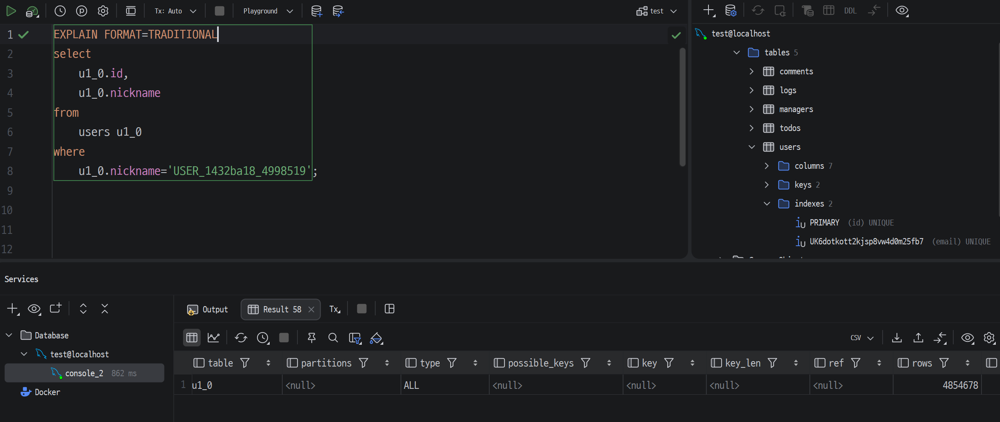
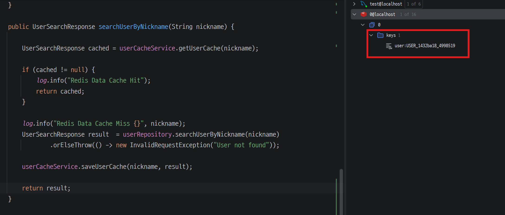

# Level 3
## 12. AWS 활용

---

### [1-1] EC2 설정

  

### [1-2] Health Check

  

---

### [2-1] RDS - 데이터베이스

  

### [2-2] 보안 그룹

  

---

### [3-1] S3 - 버킷

  

### [3-2] 파일 업로드

  

### [3-3] 버킷에 업로드된 파일 확인

  

### [3-4] Presigned URL 조회

  

---

# Level 3
## 13. 대용량 데이터 처리

---

### [1-1] 최초 조회 속도

  

### [1-2] 최초 조회 쿼리 성능

  

---

### [2-1] 인덱스 적용 후 쿼리 성능

  

### [2-2] 인덱스 적용 후 조회 속도

  

---

### [3-1] Redis 적용 후

  

### [3-2] 인덱스 적용 후 조회 속도

  

---
